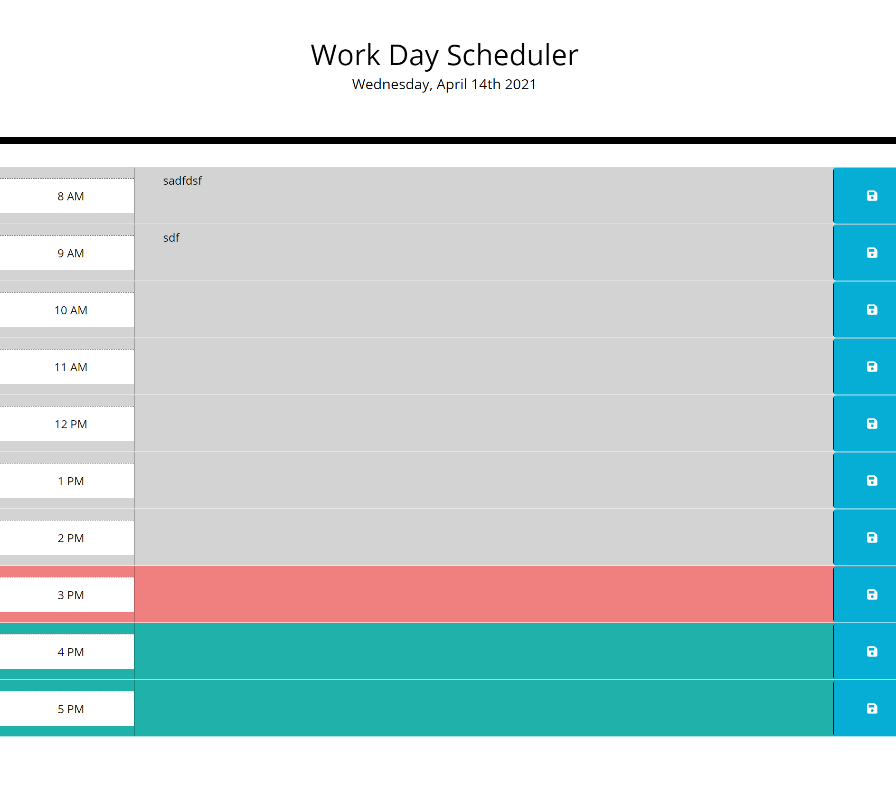

# Workday Scheduler

## Description

Workday scheduler is a project practicing setting and getting from localStorage.  This project also uses JQuery for practice in legacy code.  Workday Schedule also uses moment.js for updated date and time functionality.

## Table of Contents
* [Installation](#installation)
* [Questions](#questions)

## Installation

After cloning the repo, open index.js for the web application.

## Screenshots

## Questions  

Feel free to checkout my other projects https://github.com/nrhuizar
Or you can reach me @ nrhuizar@gmail.com